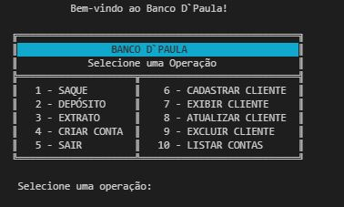
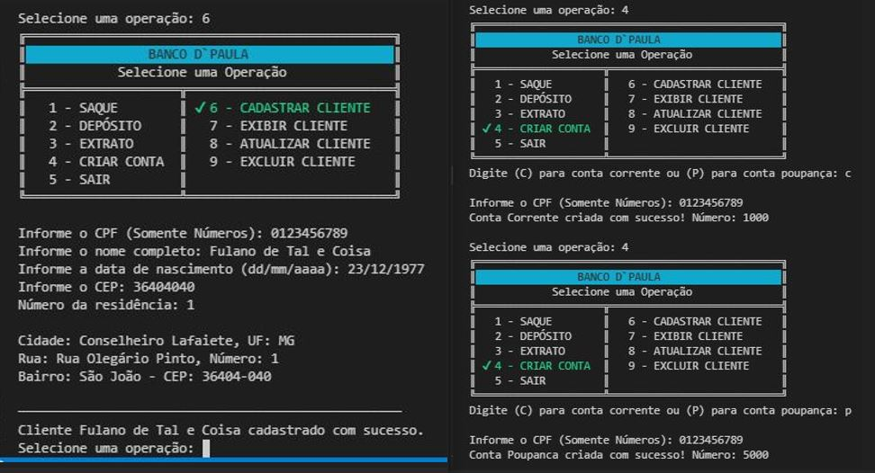
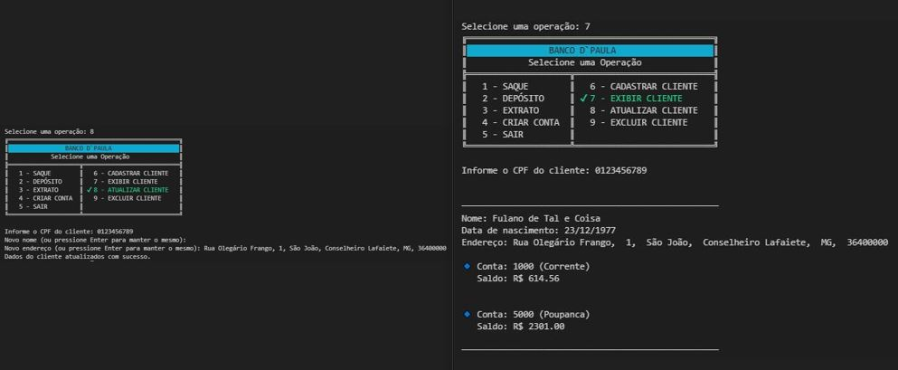
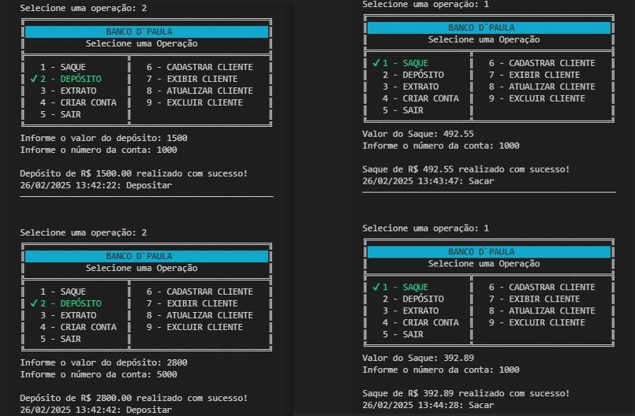
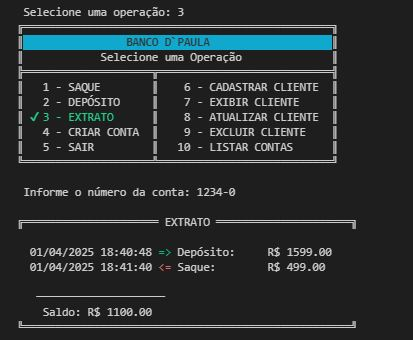

# 🏦 Desafio Modelando o Sistema Bancário em POO com Python - Banco D'Paula

Este projeto faz parte de um desafio para aprimorar a implementação de um sistema bancário utilizando Programação Orientada a Objetos (POO). O objetivo é substituir o uso de dicionários para armazenar os dados de clientes e contas bancárias por uma estrutura baseada em classes, seguindo um modelo UML.
---

## 📌 Funcionalidades

✅ Cadastro de clientes com CPF e endereço.<br>
✅ Criação de contas bancárias (Corrente e Poupança).<br>
✅ Depósitos e saques, com verificação de saldo e limites.<br>
✅ Emissão de extrato detalhado com transações registradas.<br>
✅ Atualização e exclusão de clientes.<br>
✅ Interface via terminal, interativa e intuitiva.<br>

---
## 📌 Objetivos
Refatorar a implementação existente para utilizar classes e objetos.
Seguir os princípios da Programação Orientada a Objetos (encapsulamento, herança e polimorfismo).
Estruturar o código de forma clara e organizada, facilitando a manutenção e escalabilidade.

## 🎮 **Como Usar**

#### 1️⃣ Clone este repositório:
   ```bash
   git clone https://github.com/Alanderson-Paula/desafio-sistema_bancario_POO.git
   cd desafio-sistema_bancario_POO
   ```
#### 2️⃣ Instale as dependências necessárias (se houver):

```bash
pip install colorama brazilcep
```
#### 3️⃣ Execute o programa:

```bash
python main.py
```

#### 4️⃣ Escolha uma das opções do menu exibido no terminal para interagir com o sistema.

## 📌 Telas do Menu
### 📜 Menu Principal


### 🏧 Cadastrar Cliente | Criar Conta


### 🏧 Atualizar | Exibir Cliente


### 💰🏧 Operação de Depósito e Saque


### 📄 Extrato da Conta



## 🛠️ Tecnologias Utilizadas
- Python 3
- Conceitos de POO
- UML para modelagem
- Biblioteca [Colorama](https://github.com/tartley/colorama) (para formatação de cores no terminal)
- [BrazilCEP](https://brazilcep.readthedocs.io/) (para consulta de endereço via CEP)
    #### 📍 BrazilCEP – Biblioteca de Busca de Endereço pelo CEP
    A biblioteca brazilcep foi utilizada no projeto para realizar a consulta do endereço completo a partir do CEP informado. Sua principal vantagem é a facilidade de integração e a dinamicidade que ela oferece. Ao invés de o usuário ter que inserir o endereço completo manualmente, basta informar o CEP, e a biblioteca retorna automaticamente informações como:

    - Rua
    - Bairro
    - Cidade
    - Estado

    Isso torna o processo de cadastro de clientes muito mais ágil, permitindo que o sistema obtenha rapidamente os dados corretos a partir do CEP.

    Além disso, caso o CEP não seja encontrado ou esteja incorreto, a biblioteca lida com exceções de forma transparente, permitindo que o sistema continue a execução sem que o usuário seja impactado por erros técnicos.

    #### 🎨 Colorama – Formatação de Cores no Terminal
    A biblioteca colorama é utilizada no projeto para melhorar a interatividade e visualização das mensagens no terminal, tornando a experiência do usuário mais agradável e dinâmica.

    Ela oferece a capacidade de formatar o texto no terminal com cores e estilos, como:

    - Cores de texto (ex.: verde, vermelho, amarelo)
    - Estilos de texto (ex.: negrito, reset)
    - Formatação de fundo (ex.: cor de fundo específica)

    Isso é especialmente útil no seu projeto para exibir mensagens de alerta, avisos e resultados das transações de forma clara e diferenciada. Por exemplo, mensagens de erro podem ser exibidas em vermelho para chamar atenção, enquanto mensagens de sucesso podem ser verdes. Essa formatação ajuda o usuário a identificar rapidamente a natureza da informação, seja ela um erro, alerta ou confirmação de sucesso.

## 📌 Melhorias Futuras 🔥
- Implementação de uma interface gráfica.
- Integração com um banco de dados real.
- Implementação de autenticação de usuário via senha.

## 🚀 Conclusão
Este projeto de Sistema Bancário em POO simula operações essenciais, como saque, depósito, consulta de extrato, cadastro, atualização de dados e exclusão de clientes. Além disso, permite a criação de contas bancárias separadas por tipo, como conta corrente e conta poupança, identificadas por números específicos.

A biblioteca brazilcep foi utilizada para facilitar o preenchimento automático de endereços a partir do CEP, tornando o processo mais ágil e preciso. Já a biblioteca colorama foi empregada para formatar as mensagens no terminal, proporcionando uma melhor experiência visual e tornando a interação com o usuário mais intuitiva.

Este projeto faz parte de um treinamento da DIO e demonstra a importância de uma interface simples e funcional. Além disso, evidencia a aplicação prática das habilidades adquiridas no treinamento, integrando bibliotecas poderosas para aprimorar tanto a usabilidade quanto a eficiência do sistema.

## 📝 Contribuição
Contribuições são bem-vindas! Para contribuir:

- Faça um fork do projeto.
- Crie uma branch para sua modificação
    ```bash
    git checkout -b minha-modificacao
    ```
- Faça o commit
    ```bash
    git commit -m "Minha melhoria"
    ```
- Envie para o GitHub
    ```bash
    git push origin minha-modificacao
    ```
- Abra um Pull Request.

## 📄 Licença
Este projeto está sob a licença MIT. Sinta-se livre para modificá-lo e usá-lo conforme necessário.


<br><br><br><br><br>
<p align="right">𝒜𝓁𝒶𝓃𝒹𝑒𝓇𝓈𝑜𝓃 𝒯𝒶𝒹𝑒𝓊 𝒹𝑒 𝒫𝒶𝓊𝓁𝒶 💙</p>

